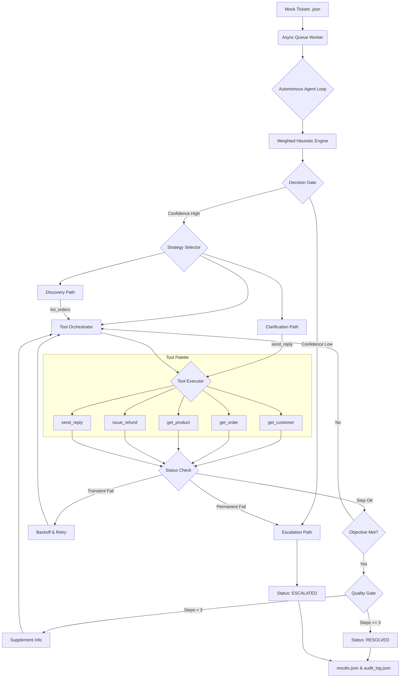

# Agentic Support Architecture

```mermaid
graph TD
    A[Mock Tickets .json] --> B(Async Queue Worker)
    B --> C{Autonomous Agent Loop}
    
    C --> D[Weighted Heuristic Engine]
    D --> E{Decision Gate}
    
    E -->|Confidence Low| S[Escalation Path]
    E -->|Confidence High| F{Strategy Selector}
    
    F --> G[Tool Orchestrator]
    F --> H[Clarification Path]
    H -->|send_reply| J
    F --> I[Discovery Path]
    I -->|list_orders| G

    G --> J{Tool Executor}
    subgraph Tool_Palette [Tool Palette]
        J --> T1[get_customer]
        J --> T2[get_order]
        J --> T3[get_product]
        J --> T4[issue_refund]
        J --> T5[send_reply]
    end

    T1 & T2 & T3 & T4 & T5 --> K{Status Check}
    
    K -->|Transient Fail| L[Backoff & Retry]
    L --> G
    
    K -->|Permanent Fail| S
    
    K -->|Step OK| M{Objective Met?}
    M -->|No| G
    M -->|Yes| N{Quality Gate}
    
    N -->|Steps < 3| O[Supplement Info]
    O --> G
    N -->|Steps >= 3| P[Status: RESOLVED]
    
    S --> Q[Status: ESCALATED]
    
    P & Q --> R[results.json & audit_log.json]
```
