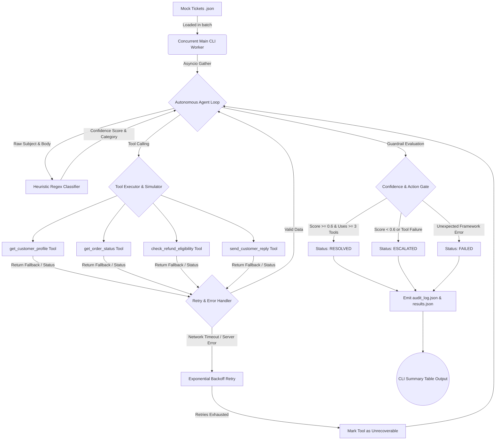

## Agentic Support Architecture

```mermaid
graph TD
    A[Mock Tickets .json] -->|Loaded in batch| B(Concurrent Main CLI Worker)
    B -->|Asyncio Gather| C{Autonomous Agent Loop}
    
    C -->|Raw Subject & Body| D[Heuristic Regex Classifier]
    D -->|Confidence Score & Category| C
    
    C -- Tool Calling --> E{Tool Executor & Simulator}
    E --> F[get_customer_profile Tool]
    E --> G[get_order_status Tool]
    E --> H[check_refund_eligibility Tool]
    E --> I[send_customer_reply Tool]
    
    F & G & H & I -- Return Fallback / Status --> J{Retry & Error Handler}
    J -->|Valid Data| C
    J -->|Network Timeout / Server Error| K[Exponential Backoff Retry]
    K -- Retries Exhausted --> L[Mark Tool as Unrecoverable]
    L --> C
    
    C -- Guardrail Evaluation --> M{Confidence & Action Gate}
    M -- Score >= 0.6 & Uses >= 3 Tools --> N[Status: RESOLVED]
    M -- Score < 0.6 or Tool Failure --> O[Status: ESCALATED]
    M -- Unexpected Framework Error --> P[Status: FAILED]
    
    N & O & P --> Q[Emit audit_log.json & results.json]
    Q --> R((CLI Summary Table Output))
```
