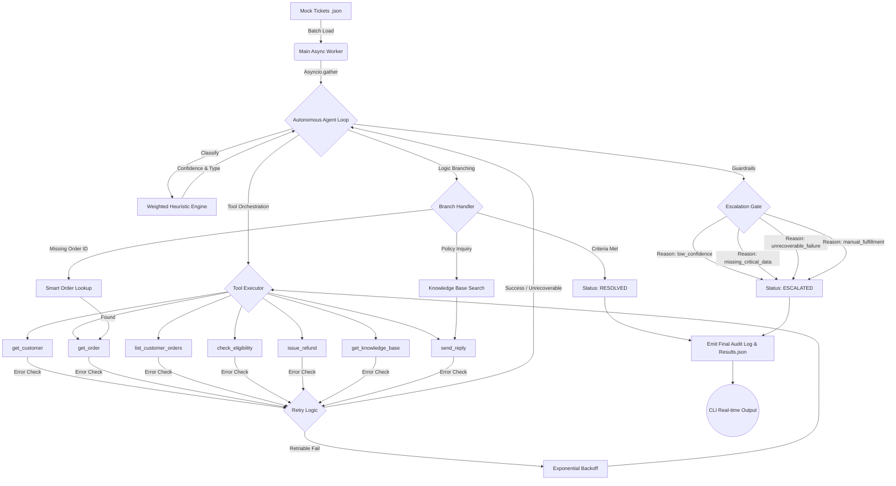

## Agentic Support Architecture

```mermaid
graph TD
    A[Mock Tickets .json] -->|Batch Load| B(Main Async Worker)
    B -->|Asyncio.gather| C{Autonomous Agent Loop}
    
    C -->|Classify| D[Weighted Heuristic Engine]
    D -->|Confidence & Type| C
    
    C -- Tool Orchestration --> E{Tool Executor}
    E --> F[get_customer]
    E --> G[get_order]
    E --> H[list_customer_orders]
    E --> I[check_eligibility]
    E --> J[issue_refund]
    E --> K[get_knowledge_base]
    E --> L[send_reply]
    
    F & G & H & I & J & K & L -->|Error Check| M{Retry Logic}
    M -->|Retriable Fail| N[Exponential Backoff]
    N --> E
    M -->|Success / Unrecoverable| C
    
    C -- Logic Branching --> O{Branch Handler}
    O -->|Missing Order ID| P[Smart Order Lookup]
    P -->|Found| G
    O -->|Policy Inquiry| Q[Knowledge Base Search]
    Q --> L
    O -->|Criteria Met| R[Status: RESOLVED]
    
    C -- Guardrails --> S{Escalation Gate}
    S -->|Reason: low_confidence| T[Status: ESCALATED]
    S -->|Reason: missing_critical_data| T
    S -->|Reason: unrecoverable_failure| T
    S -->|Reason: manual_fulfillment| T
    
    R & T --> U[Emit Final Audit Log & Results.json]
    U --> V((CLI Real-time Output))
```
